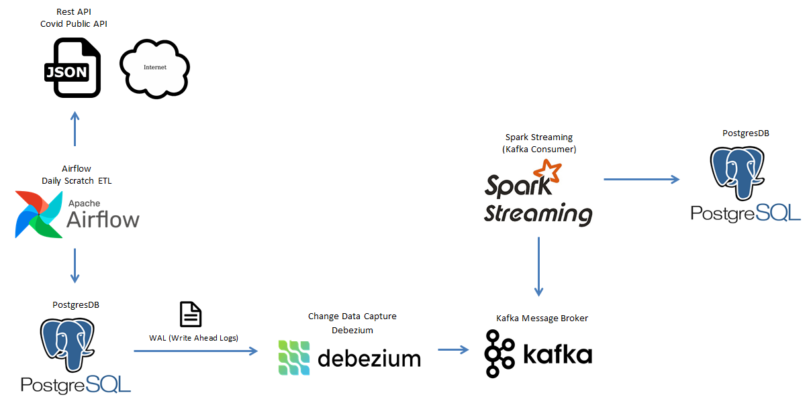

# Capturing Data Changes by Using Debezium

This project contains the following `containers`:

* `python-producer`: Python apps sebagai producer kafka.
    * Image: Dockerfile
    * References: https://hub.docker.com/_/python

* `zookeeper`: Zookerper kafka cluster manager.
    * Image: confluentinc/cp-zookeeper:6.2.0
    * Port: 22181
    * References: 
        * https://hub.docker.com/r/confluentinc/cp-zookeeper
        * https://github.com/confluentinc/kafka-images

* `kafka`: Kafka message broker.
    * Image: confluentinc/cp-kafka:6.2.0
    * Port: 29092
    * References: 
        * https://hub.docker.com/r/confluentinc/cp-kafka
        * https://github.com/confluentinc/kafka-images

* `spark`: Spark Master.
    * Image: docker.io/bitnami/spark:3
    * Port: 4040
    * References: 
        * https://hub.docker.com/r/bitnami/spark 
        * https://github.com/bitnami/bitnami-docker-spark        

* `postgres`: Postgres database menyimpan streaming data dari kafka.
    * Image: postgres:13.2
    * Database Port: 5432
    * References: https://hub.docker.com/_/postgres

## Architecture Components

