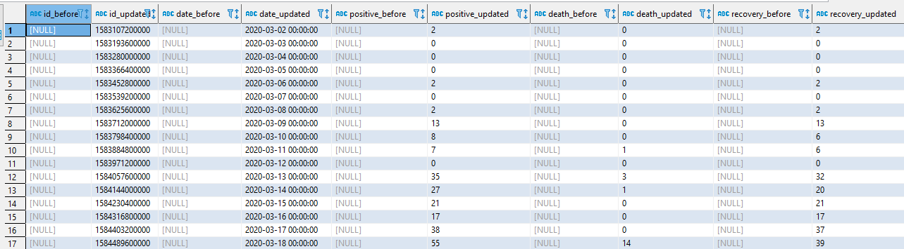

# Capturing Data Changes by Using Debezium

## Pre-requisites
* `Docker and Docker Compose`
* `Git (Optional)`

This project contains the following `containers`:

* `postgres`: Postgres database for storing project data.
    * Image: 
        * postgres:13.2
        * debezium/postgres:12
    * Database Port: 5432
    * References: 
        * https://hub.docker.com/_/postgres
        * https://hub.docker.com/r/debezium/postgres

* `airflow`: Schedular and ETL generator.
    * Image: puckel/docker-airflow:1.10.9
    * Port: 8080
    * References: 
        * https://hub.docker.com/r/puckel/docker-airflow
        * https://github.com/puckel/docker-airflow
        
* `zookeeper`: Zookerper as kafka cluster manager.
    * Image: debezium/zookeeper:latest
    * Port: 2181
    * References: https://hub.docker.com/r/debezium/zookeeper

* `kafka`: Kafka message broker.
    * Image: debezium/kafka:latest
    * Port: 9092
    * References: https://hub.docker.com/r/debezium/kafka

* `debezium`: Reading data captured from WAL (write ahead logs) and produce to kafka.
    * Image: debezium/connect:latest
    * Port: 8083
    * References: https://hub.docker.com/r/debezium/connect

* `spark`: Spark Master as kafka consumer.
    * Image: bitnami/spark:3.1.2
    * Port: 4040
    * References: 
        * https://hub.docker.com/r/bitnami/spark 
        * https://github.com/bitnami/bitnami-docker-spark        


## Architecture Components


## Setup
### Clone project
Clone this repository by using command:

    $ git clone https://github.com/arinannp/debezium-postgres.git

### Build and start containers
If we want to run containers, we can run this following command:
        
    $ docker-compose -f docker-compose.yaml up -d

Note: -d command is using for running docker in background.

### Check containers logs
You can easily check the log of containers that have been built, whether the containers / apps are ready.
        
    $ docker-compose -f docker-compose.yaml logs --tail 10

Note: --tail command will display only the last n logs.

### Register debezium connector
Register the postgres database (username & password: debezium, database: covid) to debezium connector using curl command: 
        
    $ curl -i -X POST -H "Accept:application/json" -H "Content-Type:application/json" localhost:8083/connectors/ -d "@connector/debezium.json"

Note: check the registered connector in debezium using command:
```
curl -H "Accept:application/json" localhost:8083/connectors/
```


### Access The Containers That Have Been Built
Spark Master: http://localhost:4040

Airflow User Interface: http://localhost:8080

Kafka Message Broker:
* Server: localhost:29092

Postgres Database for storing daily ETL airflow data:
* Server: localhost:5432
* Database: covid
* User: debezium
* Password: debezium

Postgres Database for storing the CDC (change data capture) data:
* Server: localhost:5431
* Database: warehouse
* User: warehouse
* Password: warehouse


### How to Implement CDC (Change Data Capture) Using Debezium
#### Airflow
1. Activate the daily ETL job using airflow UI (http://localhost:8080), click the ON button.
    

2. Check the airflow DAG dependecies and workflow, click the Tree View button.
    

3. If there is a problem with the task, you can check the Task Log.
    

#### Kafka
1. If we want to check the kafka topics, you can use this command:
```
docker exec -it kafka /kafka/bin/kafka-topics.sh --bootstrap-server localhost:9092 --list
```

2. The command above will display all topics that have been produced.
    

#### Spark
1. Consume data from kafka topic `DEBEZIUM.public.last_scratch` and store it to postgres (username, password & database: warehouse) as last_scratch table.
    
```
docker exec -it spark spark-submit --master local[*] --packages org.apache.spark:spark-sql-kafka-0-10_2.12:3.1.2 --driver-class-path /opt/bitnami/spark/connector/postgresql-9.4.1207.jar /opt/bitnami/spark/project/spark_structured_streaming_last_scratch.py
```

2. Consume data from kafka topic `DEBEZIUM.public.covid_api` and store it to postgres (username, password & database: warehouse) as covid_api table.
    
```
docker exec -it spark spark-submit --master local[*] --packages org.apache.spark:spark-sql-kafka-0-10_2.12:3.1.2 --driver-class-path /opt/bitnami/spark/connector/postgresql-9.4.1207.jar /opt/bitnami/spark/project/spark_structured_streaming_covid_api.py
```


## Test The CDC (Change Data Capture) Debezium
1. Login to posgres database (username & password: debezium, database: covid).
```
docker exec -it postgres-db psql -U debezium debezium -d covid
```


2. Update covid_api table in column positive with id 1583107200000.
```
UPDATE covid_api SET positive=0 WHERE id=1583107200000;
```
- The kafka json message should be:
```
{   
    "before": 
        {
            "id":1583107200000,
            "date":"2020-03-02 00:00:00",
            "death":0,
            "recover":0,
            "positive":2,
            "recovery":2,
            "death_cumulatif":0,
            "recover_cumulatif":0,
            "positive_cumulatif":2,
            "recovery_cumulatif":2,
            "scraping_id":1
        },
    "after":
        {
            "id":1583107200000,
            "date":"2020-03-02 00:00:00",
            "death":0,
            "recover":0,
            "positive":0,
            "recovery":2,
            "death_cumulatif":0,
            "recover_cumulatif":0,
            "positive_cumulatif":2,
            "recovery_cumulatif":2,
            "scraping_id":1
        },
    "source":
        {
            "version":"1.6.1.Final",
            "connector":"postgresql",
            "name":"DEBEZIUM",
            "ts_ms":1630122472428,
            "snapshot":"false",
            "db":"covid",
            "sequence":"[null,\"24762296\"]",
            "schema":"public",
            "table":"covid_api",
            "txId":1039,
            "lsn":24762624,
            "xmin":null
        },
    "op":"u",
    "ts_ms":1630122473815,
    "transaction":null
}
```
- The updated data is captured in postgres (username, password & database: warehouse).
     

3. Delete data in covid_api table with id 1583107200000.
```
DELETE FROM covid_api WHERE id=1583107200000;
```
- The kafka json message should be:
```
{
    "before":
        {
            "id":1583107200000,
            "date":"2020-03-02 00:00:00",
            "death":0,
            "recover":0,
            "positive":0,
            "recovery":2,
            "death_cumulatif":0,
            "recover_cumulatif":0,
            "positive_cumulatif":2,
            "recovery_cumulatif":2,
            "scraping_id":1
        },
    "after":null,
    "source":
        {
            "version":"1.6.1.Final",
            "connector":"postgresql",
            "name":"DEBEZIUM",
            "ts_ms":1630122803368,
            "snapshot":"false",
            "db":"covid",
            "sequence":"[\"24762624\",\"24762624\"]",
            "schema":"public",
            "table":"covid_api",
            "txId":1040,
            "lsn":24788576,
            "xmin":null
        },
    "op":"d",
    "ts_ms":1630122803778,
    "transaction":null
}
```
- The deleted data is captured in postgres (username, password & database: warehouse).
    


## Stops and Removes Containers, Networks & Volumes
Optionally if you want to delete all containers that have been built earlier, you can run:
        
    $ docker-compose -f docker-compose.yaml down


## Reference
   * https://debezium.io/
   * https://github.com/orgs/debezium/repositories